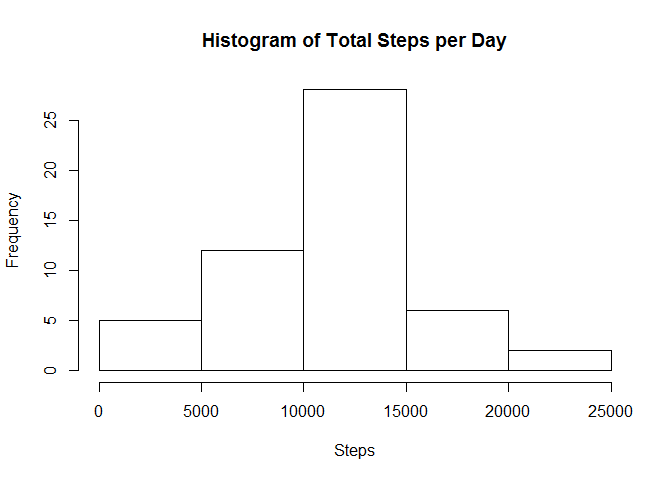
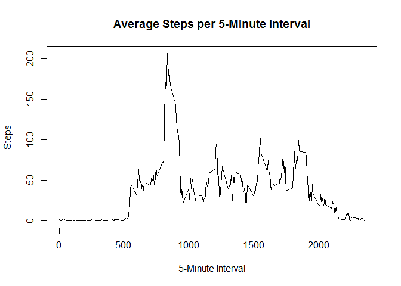
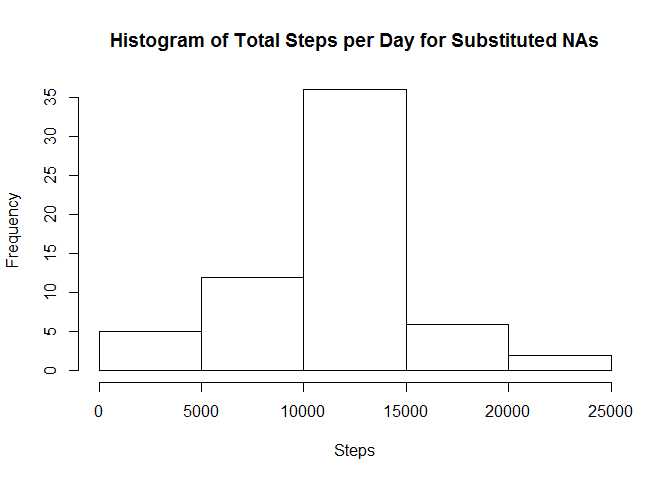
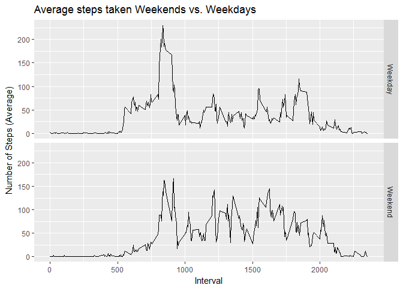

# courseproject1
Sven Otto  
27 March 2017  


# Reproducible Research Project 1  

## Introduction  

It is now possible to collect a large amount of data about personal movement using activity monitoring devices such as a Fitbit, Nike Fuelband, or Jawbone Up. These type of devices are part of the "quantified self" movement - a group of enthusiasts who take measurements about themselves regularly to improve their health, to find patterns in their behavior, or because they are tech geeks. But these data remain under-utilized both because the raw data are hard to obtain and there is a lack of statistical methods and software for processing and interpreting the data.  

This assignment makes use of data from a personal activity monitoring device. This device collects data at 5 minute intervals through out the day. The data consists of two months of data from an anonymous individual collected during the months of October and November, 2012 and include the number of steps taken in 5 minute intervals each day.  

## Data For the Analysis

The data can be downloaded from the course web site:
[Activity Monitoring Data](https://d396qusza40orc.cloudfront.net/repdata%2Fdata%2Factivity.zip)  

The variables included in this dataset are:

- **steps**: Number of steps taking in a 5-minute interval (missing values are coded as NA)

- **date**: The date on which the measurement was taken in YYYY-MM-DD format

- **interval**: Identifier for the 5-minute interval in which measurement was taken

The dataset is stored in a comma-separated-value (CSV) file and there are a total of 17,568 observations in this dataset.

## Loading and preprocessing the data

Loading the required packages:

```r
library(ggplot2)
```
Loading the data and assigning it to "activity". Afterwards basic processing is carried out:

```r
activity <- read.csv("activity.csv")

activity$day <- weekdays(as.Date(activity$date))
activity$DateTime<- as.POSIXct(activity$date, format="%Y-%m-%d")
activityclean <- na.omit(activity)
```

## Answering the assignement questions

### What is mean total number of steps taken per day?

```r
stepsperday <- aggregate(activity$steps ~ activity$date, FUN=sum)
colnames(stepsperday) <- c("Day", "Steps")
hist(stepsperday$Steps, xlab="Steps", main = "Histogram of Total Steps per Day")
```

<!-- -->

Further calculation:

```r
meansteps <- mean(stepsperday$Steps)
mediansteps <- median(stepsperday$Steps)
```
**The mean steps per day are 1.0766189\times 10^{4} and the median steps are 10765.** 


### What is the average daily activity pattern?

```r
stepsperinterval <- aggregate(activity$steps ~ activity$interval, FUN=mean)
colnames(stepsperinterval) <- c("Interval", "Steps")
plot(stepsperinterval$Interval, stepsperinterval$Steps, type="l", xlab="5-Minute Interval",
     ylab="Steps", main="Average Steps per 5-Minute Interval")
```

<!-- -->


```r
maxsteps <- max(stepsperinterval$Steps)
maxinterval <- stepsperinterval[stepsperinterval$Steps == maxsteps,1]
```
**Interval 835 contains the maximum number of steps at 206.1698113 steps.**


### Imputing missing values
We calculate the numbers of rows for the original and cleaned data set(with NAs removed). Their difference tells us how many rows featured NA values

```r
activityclean <- na.omit(activity)

raw <- nrow(activity)
clean <- nrow(activityclean)
raw-clean
```

```
## [1] 2304
```
As can be seen, 2304 rows feature NA values in the column "Steps".

Their entries will be substituted with the average number of steps during that 5 minute interval over all days.

```r
completedactivity <- activity
for (i in 1:nrow(completedactivity)) {
    if (is.na(completedactivity$steps[i])) {
        # Find the index value for when the interval matches the average
        index <- which(completedactivity$interval[i] == stepsperinterval$Interval)
        # Assign the value to replace the NA
        completedactivity$steps[i] <- stepsperinterval[index,]$Steps
    }
}
```

The NAs were successfully substituted. This can be seen by comparing the head outputs for activity (with NAs) vs. completedactivity (NAs substituted)

```r
head(activity)
```

```
##   steps       date interval    day   DateTime
## 1    NA 2012-10-01        0 Montag 2012-10-01
## 2    NA 2012-10-01        5 Montag 2012-10-01
## 3    NA 2012-10-01       10 Montag 2012-10-01
## 4    NA 2012-10-01       15 Montag 2012-10-01
## 5    NA 2012-10-01       20 Montag 2012-10-01
## 6    NA 2012-10-01       25 Montag 2012-10-01
```

```r
head(completedactivity)
```

```
##       steps       date interval    day   DateTime
## 1 1.7169811 2012-10-01        0 Montag 2012-10-01
## 2 0.3396226 2012-10-01        5 Montag 2012-10-01
## 3 0.1320755 2012-10-01       10 Montag 2012-10-01
## 4 0.1509434 2012-10-01       15 Montag 2012-10-01
## 5 0.0754717 2012-10-01       20 Montag 2012-10-01
## 6 2.0943396 2012-10-01       25 Montag 2012-10-01
```

Now we re-calcultate the first graph with the new dataset.

```r
stepsperday2 <- aggregate(completedactivity$steps ~ completedactivity$date, FUN=sum)
colnames(stepsperday2) <- c("Day", "Steps")
hist(stepsperday2$Steps, xlab="Steps", main = "Histogram of Total Steps per Day for Substituted NAs")
```

<!-- -->
  

```r
meansteps2 <- mean(stepsperday2$Steps)
mediansteps2 <- median(stepsperday2$Steps)
```

**The mean steps per day are 1.0766189\times 10^{4} and the median steps are 1.0766189\times 10^{4}.**   

Comparing these values to the mean and median of the first tasks, the mean has not changed while the median has increased.

### Are there differences in activity patterns between weekdays and weekends?

Separating weekdays from the weekend

```r
completedactivity$daytype <- ifelse(completedactivity$day %in% c("Samstag", "Sonntag"),
                                    "Weekend", "Weekday")
```

Next we calculate the average weekday steps vs. average weekend steps and create the plot:

```r
stepsperinterval2 <- aggregate(steps ~ interval + daytype, data=completedactivity, FUN=mean)
colnames(stepsperinterval2) <- c("Interval", "Daytype", "Steps")

library(ggplot2)
qplot(Interval, Steps, data=stepsperinterval2,
      type="l",
      geom="line",
      xlab="Interval",
      ylab="Number of Steps (Average)",
      main="Average steps taken Weekends vs. Weekdays",
      facets =Daytype ~ .)
```

```
## Warning: Ignoring unknown parameters: type
```

<!-- -->

**As can be seem in the graph above, activity begins slightly earlier on weekdays than on the weekend.**

